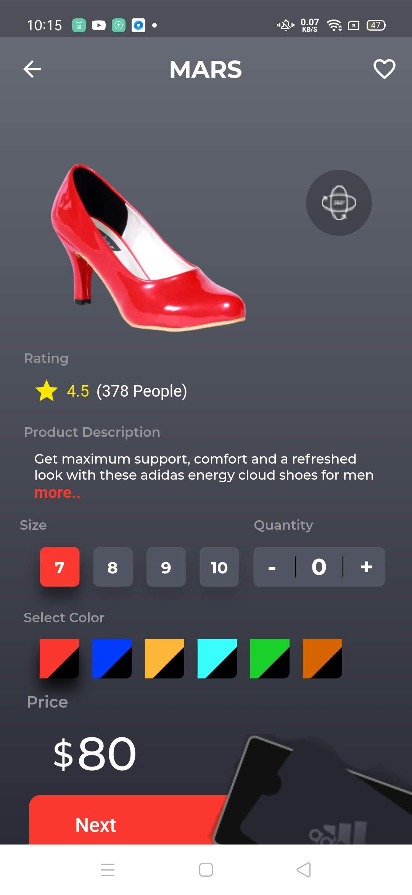

[![Contributors][contributors-shield]][contributors-url]
[![Forks][forks-shield]][forks-url]
[![Stargazers][stars-shield]][stars-url]
[![Issues][issues-shield]][issues-url]
[![MIT License][license-shield]][license-url]
[![LinkedIn][linkedin-shield]][linkedin-url]

<!-- PROJECT LOGO -->
 

  

  <h2 align="center">Project MARS</h2>
  <h3 align="center">Team Solution_404</h3>
  <h3 align="center">Thapar Institute of Engineering & Technology</h3>

  

    We have created a comprehensive and user friendly shopping experience. It includes state-of-the-art recommendation system, deep learning based body measurement solution and unique  3D avatar creation and clothes try on using computer vision and augmented reality.
     
    <a href="https://github.com/shagilsiddiqui/MyntraHackathon"><strong>Explore the docs »</strong></a>
     
     
    <a href="https://github.com/shagilsiddiqui/MyntraHackathon">View Demo</a>
    ·
    <a href="https://github.com/shagilsiddiqui/MyntraHackathon">Report Bug</a>
    ·
    <a href="https://github.com/shagilsiddiqui/MyntraHackathon">Request Feature</a>
  

<!-- ABOUT THE PROJECT -->
## About The Project

[![Product Name Screen Shot][product-screenshot]](https://example.com)

A 'pain' for every business- Sales Return Sales return are incurred commonly and 'uninvitedly' when the product displayed online and the one delivered in real are compared and a clear disparity between the both comes into picture. It is said, Nothing deflates faster than a punctured reputation and the disparity mentioned above slaps 'irreversible' blemishes on any brand's reputation.
Here is, when AR and VR emerges as a helping hand to bridge the disparity between both worlds viz. Digital and Real.

Who doesn’t love online shopping? It is convenient, offers a wide selection of products and we get great deals. Retailers also benefit from the reach internet
provides and get a chance to establish their brand. As a result, the online fashion industry has seen tremendous growth in recent years. However, shopping
for clothes online is still tricky owing to wide sizing variations across different brands that make it tough for customers to identify proper fitting clothes. For
customers, it leads to a bad shopping experience as they might have to return the products and for retailers, this results in monetary losses.

### Built With

* [TensorFlow]
* [Python3]
* [OpenCV]
* [Flask]
* [Flutter]
* [Javascript]
* [ARkit/ARcore]

<!-- GETTING STARTED -->
## ScreenShots

<!-- LICENSE -->
## License

Distributed under the MIT License. See `LICENSE` for more information.

<!-- CONTACT -->
## Contact

MD Shagill   email@example.com

Sidhant Goyal. sidhant702@gmail.com

<!-- ACKNOWLEDGEMENTS -->

<!-- MARKDOWN LINKS & IMAGES -->
<!-- https://www.markdownguide.org/basic-syntax/#reference-style-links -->
[contributors-shield]: https://img.shields.io/github/contributors/othneildrew/Best-README-Template.svg?style=flat-square
[contributors-url]: https://github.com/othneildrew/Best-README-Template/graphs/contributors
[forks-shield]: https://img.shields.io/github/forks/othneildrew/Best-README-Template.svg?style=flat-square
[forks-url]: https://github.com/othneildrew/Best-README-Template/network/members
[stars-shield]: https://img.shields.io/github/stars/othneildrew/Best-README-Template.svg?style=flat-square
[stars-url]: https://github.com/othneildrew/Best-README-Template/stargazers
[issues-shield]: https://img.shields.io/github/issues/othneildrew/Best-README-Template.svg?style=flat-square
[issues-url]: https://github.com/othneildrew/Best-README-Template/issues
[license-shield]: https://img.shields.io/github/license/othneildrew/Best-README-Template.svg?style=flat-square
[license-url]: https://github.com/othneildrew/Best-README-Template/blob/master/LICENSE.txt
[linkedin-shield]: https://img.shields.io/badge/-LinkedIn-black.svg?style=flat-square&logo=linkedin&colorB=555
[linkedin-url]: https://linkedin.com/in/othneildrew
[product-screenshot]: images/screenshot.png
